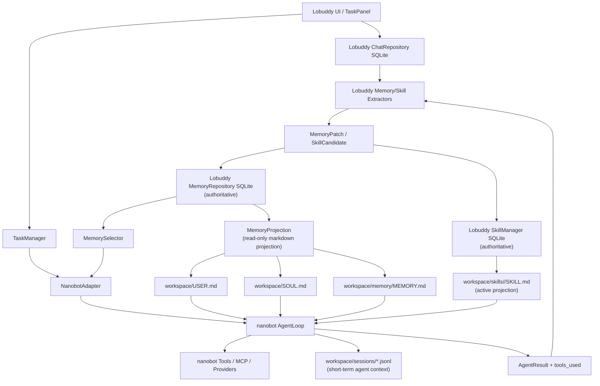

# nanobot 与 Lobuddy 系统边界分析报告

生成日期：2026-05-03  
分析范围：`core/agent/`、`core/memory/`、`core/skills/`、`app/main.py`、`lib/nanobot/nanobot/agent/`、`lib/nanobot/docs/MEMORY.md`

## 1. 结论先行

当前最合理的边界应该是：

- Lobuddy 是产品层和长期事实层的权威：用户资料、系统人格、项目记忆、会话摘要、技能生命周期都应以 Lobuddy 的 SQLite 为主。
- nanobot 是执行内核和上下文消费层：负责模型调用、工具循环、MCP、子代理、文件/命令/网页工具、session 内短期上下文、技能读取与执行提示。
- Markdown 文件只应该是兼容投影，不应该成为第二套事实来源。尤其是 `workspace/USER.md` 和 `workspace/SOUL.md`，目前 Lobuddy 会写，nanobot 原生 Dream 也有能力写，这是最需要收口的边界。

推荐目标是：Lobuddy 单写长期记忆，nanobot 只读 Lobuddy 投影；nanobot 的 Dream/MemoryStore 不直接改长期事实文件，除非改写为调用 Lobuddy MemoryService 的 patch 管道。

## 2. 当前记忆系统怎么分

### 2.1 Lobuddy 记忆系统

Lobuddy 的记忆系统是结构化、产品化、可治理的长期记忆。

主要入口：

- `core/memory/memory_schema.py`：定义 `MemoryItem`、`MemoryType`、`MemoryStatus`、`PromptContextBundle`。
- `core/memory/memory_repository.py`：SQLite 表 `memory_item`、`conversation_summary`，带状态、scope、confidence、importance、priority。
- `core/memory/memory_service.py`：负责保存、patch、冲突处理、bootstrap 身份记忆、构建 prompt context。
- `core/memory/memory_selector.py`：按预算选择 user/system/session/retrieved memories 注入 prompt。
- `core/memory/memory_projection.py`：把 SQLite 主存投影成 Markdown。
- `core/agent/nanobot_adapter.py`：每次任务运行前注入 Lobuddy 记忆，任务后触发后台记忆更新。

Lobuddy 当前的实际流向：

1. UI 提交任务时，`app/main.py` 把用户消息写入 `ChatRepository`。
2. `TaskManager` 调用 `NanobotAdapter.run_task()`。
3. `NanobotAdapter` 先同步强信号身份记忆，例如 “my name is ...”。
4. `MemoryService.build_prompt_context()` 从 SQLite 选择记忆。
5. `PromptContextBundle.build_injection_text()` 生成 `## Lobuddy Memory Context`，拼到用户 prompt 前面。
6. nanobot 执行任务。
7. 成功后，`NanobotAdapter._maybe_trigger_memory_update()` 按计数或强信号触发 `_run_memory_update()`。
8. `_run_memory_update()` 从 Lobuddy `ChatRepository` 读最近消息，让 nanobot 生成 JSON patch。
9. `MemoryService.apply_ai_response()` 解析 patch，写回 SQLite，再刷新 Markdown 投影。

Lobuddy 的长期记忆类型：

| 类型 | 当前用途 | 权威位置 |
| --- | --- | --- |
| `user_profile` | 用户姓名、偏好、沟通习惯 | SQLite `memory_item` |
| `system_profile` | Lobuddy 身份、系统行为、宠物名字 | SQLite `memory_item` |
| `project_memory` | 项目事实、决策、scope 记忆 | SQLite `memory_item` |
| `conversation_summary` | 会话摘要 | SQLite `conversation_summary` |
| `episodic_memory` | 事件记忆，当前可检索但写入较少 | SQLite `memory_item` |
| `procedural_memory` | 流程/方法类记忆，schema 已有但闭环不足 | SQLite `memory_item` |

Lobuddy 当前的 Markdown 投影：

| 投影文件 | 来源 | 被谁消费 | 备注 |
| --- | --- | --- | --- |
| `data/memory/USER.md` | `user_profile` | 人类/调试 | Lobuddy 内部投影 |
| `data/memory/SYSTEM.md` | `system_profile` | 人类/调试 | Lobuddy 内部投影 |
| `data/memory/PROJECT.md` | `project_memory` | 人类/调试 | nanobot 默认不会读这个路径 |
| `workspace/USER.md` | `user_profile` | nanobot ContextBuilder | 会进入 nanobot system prompt |
| `workspace/SOUL.md` | `system_profile` | nanobot ContextBuilder | 会进入 nanobot system prompt |

明显缺口：Lobuddy 目前没有把 `project_memory` 投影到 nanobot 默认读取的 `workspace/memory/MEMORY.md`，而是写到了 `data/memory/PROJECT.md`。这意味着 Lobuddy 的项目记忆主要靠 adapter 的 `Lobuddy Memory Context` 注入，而不是 nanobot 原生 `# Memory / Long-term Memory`。

### 2.2 nanobot 记忆系统

nanobot 的记忆系统是文件型、agent-native、以 workspace 为中心的运行记忆。

主要入口：

- `lib/nanobot/nanobot/agent/memory.py`
  - `MemoryStore`：读写 `workspace/USER.md`、`workspace/SOUL.md`、`workspace/memory/MEMORY.md`、`workspace/memory/history.jsonl`。
  - `Consolidator`：上下文压力大时，把旧消息摘要追加到 `history.jsonl`。
  - `Dream`：读取 `history.jsonl` 和长期记忆文件，再用 `read_file/edit_file` 修改 `USER.md`、`SOUL.md`、`MEMORY.md`。
- `lib/nanobot/nanobot/agent/context.py`
  - `ContextBuilder`：构建 system prompt。
  - 默认读取 `AGENTS.md`、`SOUL.md`、`USER.md`、`TOOLS.md`。
  - 默认读取 `workspace/memory/MEMORY.md` 作为 Long-term Memory。
  - 默认列出 workspace skills 和 builtin skills。
- `lib/nanobot/nanobot/session/manager.py`
  - 将 agent 会话保存到 `workspace/sessions/*.jsonl`。

nanobot 的记忆层级：

| 层 | 文件/对象 | 作用 | 当前在 Lobuddy 中的地位 |
| --- | --- | --- | --- |
| 短期对话 | `Session.messages` / `workspace/sessions/*.jsonl` | agent loop 的上下文连续性 | 可复用，但不是 UI 历史权威 |
| 压缩归档 | `workspace/memory/history.jsonl` | 旧消息摘要素材 | 可复用为中间材料，但不应直接成为 Lobuddy 长期事实 |
| 长期用户 | `workspace/USER.md` | 用户稳定信息 | 应由 Lobuddy 投影，nanobot 只读 |
| 长期人格 | `workspace/SOUL.md` | bot 声音/身份 | 应由 Lobuddy 投影，nanobot 只读 |
| 长期项目 | `workspace/memory/MEMORY.md` | 项目事实/决策 | Lobuddy 需要补投影或接管 |
| 版本记录 | `GitStore` | Dream 修改记忆文件的审计 | 如果 Dream 改为 Lobuddy patch，可转为审计辅助 |

### 2.3 当前重叠和冲突

核心冲突是 `workspace/USER.md`、`workspace/SOUL.md`、`workspace/memory/MEMORY.md` 的所有权。

当前代码里：

- Lobuddy `MemoryProjection` 会写 `workspace/USER.md` 和 `workspace/SOUL.md`。
- nanobot `ContextBuilder` 会读 `workspace/USER.md` 和 `workspace/SOUL.md`。
- nanobot `Dream` 有能力编辑 `workspace/USER.md`、`workspace/SOUL.md` 和 `workspace/memory/MEMORY.md`。
- Lobuddy 的 SQLite 不知道 nanobot Dream 对这些文件做了什么。

所以边界不是“nanobot 一套、Lobuddy 一套各自运行”，而是：

- 读路径已经接上了。
- 写路径还没有明确单写者。
- 项目记忆投影路径没有完全对齐。
- skill lifecycle 已有 Lobuddy 管理层，但 nanobot 实际加载仍按文件存在与 frontmatter 判定。

## 3. Skill 边界现状

### 3.1 nanobot skill 系统

nanobot 原生 skill 是文件协议：

- workspace skill：`workspace/skills/<name>/SKILL.md`
- builtin skill：`lib/nanobot/nanobot/skills/<name>/SKILL.md`
- `SkillsLoader` 优先加载 workspace skill，再加载 builtin skill。
- `ContextBuilder` 会把技能摘要放进 system prompt，提示 agent 在需要时用 `read_file` 读取完整 `SKILL.md`。
- 支持 metadata 中的 requirements：`bins`、`env`。
- 支持 `always` skill：满足 requirements 后完整注入 context。

这套机制可以复用，因为它轻、直接、和 agent tool loop 耦合良好。

### 3.2 Lobuddy skill 系统

Lobuddy 当前已有产品化 skill 管理层：

- `core/skills/skill_schema.py`：`SkillRecord`、`SkillStatus`、`SkillCandidate`。
- `core/skills/skill_manager.py`：SQLite 表 `skill_record`、`skill_event`、`skill_candidate`，并把技能写到 `workspace/skills/<name>/SKILL.md`。
- `core/skills/skill_selector.py`：能选择 active skill 并生成摘要。
- `core/skills/skill_candidate_extractor.py`：能从成功任务和工具使用中提取候选 skill。
- `core/skills/skill_validator.py`：做基础安全校验。
- `ui/skill_panel.py`：目前更偏 UI 展示和示例填充。

当前断点：

- `SkillManager` 写出来的 active skill 会被 nanobot 文件扫描到，这是好事。
- 但是 disabled/archived/deleted 的边界还不完整：只要 `workspace/skills/<name>/SKILL.md` 仍存在，nanobot 就可能列出。
- `SkillSelector.build_skills_summary()` 暂未接入 `MemorySelector` 的 `active_skills` 字段，也没有接入 adapter prompt 注入。
- `SkillCandidateExtractor` 尚未在任务完成后形成自动候选/审批/写入的闭环。
- `SkillMaintenance(settings)` 在 `app/main.py` 中没有传入 `SkillManager`，所以维护逻辑默认不会实际处理技能。

## 4. nanobot 哪些可以复用

### 4.1 直接复用

| 模块 | 复用方式 | 原因 |
| --- | --- | --- |
| `Nanobot` / `AgentLoop` / `AgentRunner` | 继续作为执行内核 | 已处理 provider、工具循环、tool calls、MCP、子代理、上下文构建 |
| `ToolRegistry` 和内置 tools | 继续复用，但由 Lobuddy hook 加 guardrails | Lobuddy 已通过 `_ToolTracker` 做参数安全验证 |
| `SessionManager` | 继续作为 agent 短期上下文 | 能保留工具调用轨迹和模型上下文，不必映射成 UI 聊天表 |
| `ContextBuilder` bootstrap 文件读取 | 继续复用 | `AGENTS.md`、`USER.md`、`SOUL.md`、`TOOLS.md` 适合做兼容入口 |
| `SkillsLoader` | 继续复用 | 文件协议简单，天然支持 workspace 覆盖 builtin |
| builtin skills | 继续复用 | 作为基础能力说明，Lobuddy 不需要重造 |
| provider 层 | 继续复用 | Lobuddy 不应重写 OpenAI-compatible/Anthropic/Azure 等适配 |
| MCP 接入 | 继续复用 | 适合保持在 nanobot 执行层 |
| `Consolidator` 的 token 压缩思路 | 条件复用 | 可以保留作为 nanobot session 的短期压缩，但长期事实仍归 Lobuddy |

### 4.2 有条件复用

| 模块 | 当前问题 | 建议 |
| --- | --- | --- |
| `MemoryStore` | 会读写长期 Markdown 文件 | 在 Lobuddy 模式下限制为只读投影消费，写入转给 Lobuddy MemoryService |
| `Dream` | 会直接编辑 `USER.md`、`SOUL.md`、`MEMORY.md` | 改写为生成 `MemoryPatch`，或在 Lobuddy SDK 模式禁用 |
| `/dream*` 命令 | 用户可从 Lobuddy prompt 触发，造成文件和 SQLite 漂移 | 拦截、禁用，或改成 Lobuddy memory review 命令 |
| nanobot `history.jsonl` | 是压缩素材，不是结构化事实 | 可作为 memory update 的输入源之一，但不能直接作为权威记忆 |
| nanobot skill summary | 会列出所有文件技能 | 需要让 Lobuddy 的 skill status 决定哪些技能可见 |

## 5. nanobot 哪些需要重写

### 5.1 Dream 写长期文件的机制需要重写

现状：

- nanobot Dream 的 Phase 2 用 `read_file/edit_file` 直接修改长期文件。
- Lobuddy 则把长期记忆存在 SQLite，并将 Markdown 当投影。

风险：

- Dream 改了 `workspace/USER.md`，SQLite 不知道。
- 下一次 Lobuddy 投影刷新会覆盖 Dream 修改。
- 或者 Dream 修改暂时被 nanobot 读到，但 UI/设置/维护/冲突处理都看不到。

建议重写方向：

- Dream Phase 1 可以保留，用于分析历史。
- Dream Phase 2 不再调用 `edit_file`，而是输出 Lobuddy `MemoryPatch` JSON。
- 由 `MemoryService.apply_patch()` 决定 accept/reject/update/deprecate。
- 如果仍需要文件审计，GitStore 只记录投影变更，不作为事实主存。

### 5.2 nanobot MemoryStore 在 Lobuddy 模式下不能做权威写入

现状：

- `MemoryStore.write_memory()`、`write_soul()`、`write_user()` 是直接文件写。

建议：

- 增加 Lobuddy adapter 或 runtime flag。
- 在 Lobuddy 模式下：
  - `read_*` 允许。
  - `write_*` 禁用，或改成调用 Lobuddy MemoryService。

### 5.3 skill 可见性需要改成 Lobuddy 管理优先

现状：

- nanobot 只看 `workspace/skills/<name>/SKILL.md` 是否存在。
- Lobuddy 有 `SkillStatus`，但 nanobot 不知道。

建议：

- 简单方案：disabled/archived 时移动或删除 workspace skill 文件，只保留 SQLite 和 archive。
- 更稳方案：扩展 `SkillsLoader`，支持 Lobuddy 传入 active skill allowlist。
- 最小落地：`SkillManager.disable_skill()` 同步移出 `workspace/skills`，`archive_skill()` 同步移出或写 disabled marker。

### 5.4 Lobuddy config builder 需要收紧执行边界

现状：

- `build_nanobot_config()` 写入 `tools.restrictToWorkspace: False`。
- Lobuddy 主要靠 `_ToolTracker` 和 `SafetyGuardrails` 做运行时拦截。

建议：

- 将 `restrictToWorkspace` 变成 settings 可控，默认 true 或至少跟 `guardrails_enabled` 同步。
- 继续保留 Lobuddy hook guardrails，形成双层限制。

## 6. Lobuddy 需要补充的能力

### 6.1 补 `project_memory` 到 nanobot 默认路径

当前 `project_memory` 投影到 `data/memory/PROJECT.md`，但 nanobot 默认读取的是：

- `workspace/memory/MEMORY.md`

建议：

- `MemoryProjection._project_project_memory()` 同时写：
  - `data/memory/PROJECT.md`
  - `workspace/memory/MEMORY.md`
- 文件顶部写明：“Generated from Lobuddy SQLite memory; do not edit manually.”

### 6.2 给 Markdown 投影加单写者声明

建议所有投影文件加头：

```md
<!-- Generated by Lobuddy MemoryService. SQLite is authoritative. Do not edit directly. -->
```

这样人和 agent 都能看到边界。

### 6.3 把 nanobot 的 tool/session 素材纳入 Lobuddy 记忆更新输入

当前 Lobuddy memory update 主要读 `ChatRepository` 中的 UI 用户/助手消息。它不包含完整工具结果、tool call 名称、nanobot session 中的压缩轨迹。

建议补充：

- 把 `AgentResult.tools_used`、关键 tool outcome、task id 写入 memory update recent context。
- 对 `procedural_memory` 的提取要看 tool sequence，而不是只看最终聊天文本。
- 可选读取 `workspace/sessions/*.jsonl` 或 adapter result messages，但只作为提取素材，不作为长期事实。

### 6.4 skill 闭环补齐

建议补齐以下链路：

1. 任务成功后，根据 `tools_used` 调用 `SkillCandidateExtractor`。
2. 使用 `SkillValidator` 校验。
3. 低风险候选进入 `skill_candidate`，高置信度可按配置自动 approve。
4. approve 后 `SkillManager.create_skill()` 写入 `workspace/skills`。
5. disabled/archive 时同步从 `workspace/skills` 移除，防止 nanobot 继续加载。
6. `record_result()` 要能从实际 nanobot skill 使用中回写，否则 maintenance 没有数据。

### 6.5 app 初始化要注入 SkillManager

当前 `app/main.py` 创建了 `SkillMaintenance(settings)`，没有传 manager，因此 maintenance 默认空跑。

建议：

- 在 app 启动时创建 `SkillManager(settings)`。
- 传给 `SkillMaintenance(settings, manager)`。
- 传给 `SkillRegistry(manager)`，让 UI 面板展示真实技能状态。

### 6.6 明确两套会话历史的分工

建议定义：

- Lobuddy `ChatRepository`：UI 历史、用户可见聊天、session 列表、退出分析输入。
- nanobot `SessionManager`：agent 内部短期上下文、tool call 轨迹、压缩状态。

两者不需要完全合并，但需要同步关键事件：

- Lobuddy 保存用户消息和最终助手消息。
- nanobot 保存内部运行轨迹。
- 记忆提取时，Lobuddy 可以额外读取 tools_used 和必要的 nanobot session 摘要。

## 7. 推荐目标架构



目标原则：

- Lobuddy SQLite 是长期事实单一来源。
- nanobot workspace Markdown 是投影和执行输入。
- nanobot session 是短期运行状态，不直接升级为长期事实。
- skill 文件是 active skill 投影，skill 状态由 Lobuddy SQLite 决定。
- 自动记忆更新必须走 `MemoryPatch`，不能让 agent 自由编辑投影文件。

## 8. 建议落地顺序

### P0：先止血边界

1. 在 `MemoryProjection` 的所有投影文件加生成声明。
2. 将 `project_memory` 同步投影到 `workspace/memory/MEMORY.md`。
3. 拦截或禁用 Lobuddy 模式下的 `/dream`、`/dream-log`、`/dream-restore`，避免直接编辑投影文件。
4. 明确 `workspace/USER.md`、`workspace/SOUL.md`、`workspace/memory/MEMORY.md` 不允许手写，SQLite 为权威。

### P1：补齐 skill 边界

1. app 初始化 `SkillManager`，传给 `SkillMaintenance` 和 `SkillRegistry`。
2. disabled/archive/delete 时同步移除或隐藏 workspace skill 文件。
3. 任务完成后接入 `SkillCandidateExtractor` 和 `SkillValidator`。
4. 记录实际 skill 使用结果，支撑 stale review 和 failure rate。

### P2：重写 nanobot Dream 集成

1. 保留 Dream 的历史分析思路。
2. Phase 2 改为输出 `MemoryPatch`。
3. 由 Lobuddy `MemoryService.apply_patch()` 写 SQLite。
4. 需要审计时记录 patch/event，而不是让 GitStore 成为事实来源。

### P3：统一记忆提取质量

1. memory update 输入补充 `tools_used` 和关键 task metadata。
2. 对 `procedural_memory` 建立专门提取 prompt。
3. 对 `episodic_memory` 加过期策略。
4. 对 `project_memory` 加 scope 推断策略，比如当前 workspace、repo、任务类型。

## 9. 最终边界表

| 能力 | Lobuddy 负责 | nanobot 负责 |
| --- | --- | --- |
| UI 聊天历史 | SQLite `chat_session/chat_message` | 不负责 |
| agent 短期上下文 | 不直接负责，可读取摘要 | `workspace/sessions/*.jsonl` |
| 用户长期记忆 | SQLite `user_profile` 主存 | 读取 `workspace/USER.md` 投影 |
| 系统人格/宠物身份 | SQLite `system_profile` 主存 | 读取 `workspace/SOUL.md` 投影 |
| 项目长期记忆 | SQLite `project_memory` 主存 | 读取 `workspace/memory/MEMORY.md` 投影 |
| 历史压缩素材 | 可消费，不作权威 | `history.jsonl` / Consolidator |
| 自动长期记忆更新 | `MemoryPatch`、校验、写 SQLite | 提供分析能力，不直接写文件 |
| skill 生命周期 | SQLite `skill_record`、审批、状态、维护 | 读取 active skill 文件并按说明执行 |
| tool/provider/MCP | 安全策略和产品开关 | 实际执行内核 |
| 子代理 | Lobuddy 定义业务类型和隔离策略 | nanobot 实际运行 |

## 10. 关键代码证据

- `core/memory/memory_service.py:102`：Lobuddy `MemoryService` 是结构化记忆编排入口。
- `core/memory/memory_service.py:262`：`build_prompt_context()` 负责给 adapter 构建 prompt 注入。
- `core/memory/memory_service.py:311`：保存/patch 后刷新 Markdown 投影。
- `core/memory/memory_projection.py:14`：投影层明确是 SQLite 到 Markdown。
- `core/memory/memory_projection.py:84`：当前写 `workspace/USER.md`。
- `core/memory/memory_projection.py:90`：当前写 `workspace/SOUL.md`。
- `core/agent/nanobot_adapter.py:193`：Lobuddy 所有 AI 任务经 `NanobotAdapter.run_task()`。
- `core/agent/nanobot_adapter.py:210`：任务前注入 Lobuddy memory context。
- `core/agent/nanobot_adapter.py:249`：任务成功后触发记忆更新。
- `core/agent/nanobot_adapter.py:403`：后台记忆更新通过 nanobot 生成 patch，再交给 Lobuddy。
- `lib/nanobot/nanobot/agent/memory.py:31`：nanobot `MemoryStore` 是文件型记忆层。
- `lib/nanobot/nanobot/agent/memory.py:45`：nanobot 长期项目记忆路径是 `workspace/memory/MEMORY.md`。
- `lib/nanobot/nanobot/agent/memory.py:48`：nanobot 读取/写入 `workspace/SOUL.md`。
- `lib/nanobot/nanobot/agent/memory.py:49`：nanobot 读取/写入 `workspace/USER.md`。
- `lib/nanobot/nanobot/agent/memory.py:519`：nanobot `Dream` 会处理长期记忆文件。
- `lib/nanobot/nanobot/agent/context.py:20`：nanobot bootstrap 默认读 `AGENTS.md`、`SOUL.md`、`USER.md`、`TOOLS.md`。
- `lib/nanobot/nanobot/agent/context.py:37`：nanobot system prompt 会加入 `MemoryStore.get_memory_context()`。
- `lib/nanobot/nanobot/agent/skills.py:101`：nanobot 会构建 workspace/builtin skills 摘要。
- `core/skills/skill_manager.py:20`：Lobuddy `SkillManager` 是 skill 生命周期入口。
- `core/skills/skill_manager.py:26`：Lobuddy skill 投影位置也是 `workspace/skills`。
- `core/skills/skill_manager.py:98`：创建 skill 时写 `workspace/skills/<name>/SKILL.md`。

